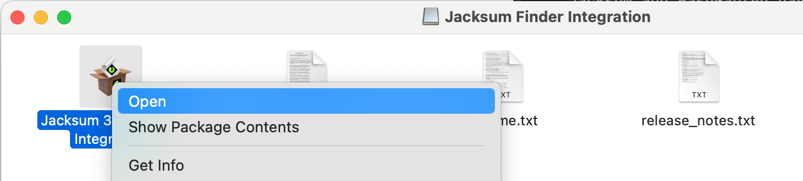
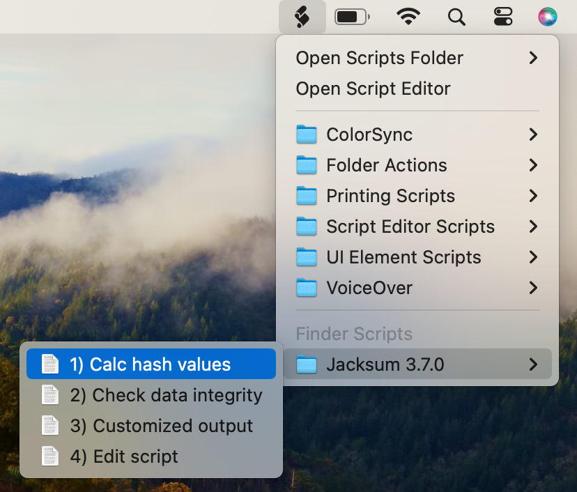

# Jacksum for macOS


## Abstract

Jacksum for macOS is an installation program that gives you easy access to the functions of Jacksum on macOS.
In other words, you can add more than 450 hash functions for free to your Mac to make it even more powerful.

The installation program installs

- a **Graphical User Interface** called [HashGarten](https://github.com/jonelo/HashGarten) which is powered by Jacksum
- Integraions for **File Managers**, see the section of "Supported File Managers" below
- a **Command Line Inerface** to call [Jacksum](https://github.com/jonelo/jacksum) in a Terminal

For more information see also [https://jacksum.net](https://jacksum.net).

## System Requirements

### Hardware

- Intel Mac (x64) or Apple silicon (aarch64)
- 150 MiB disk space

### Software

- macOS 10.11 (El Capitan) or later, tested up to macOS 14.4.1 (Sonoma)
- A supported file manager (see below)

#### Supported File Managers

File managers that supports The **Apple Script Menu**-Interface are fully supported by this integration program. In adddition to that a few proprietary interfaces are also supported.

> [!TIP]
> If your preferred file manager does not support the Apple Script Menu, nor allow to use any external scripts nor support any plug-ins, chances are high that your file manager supports at least **drag & drop**, so you could use drag & drop to transfer file/directory-paths from your file manager to the HashGarten GUI where you can process data further, e. g. calculate hashes from file/directory-paths.

The following File Managers have been tested successfully to work with Jacksum and HashGarten:

| File Manager                                                                   | Supported Interfaces  | Comment                                                                                  |
|--------------------------------------------------------------------------------|-----------------------|---------------------------------------------------------------|
| [Finder](https://support.apple.com/guide/mac-help/mchlp2605/mac)               | DnD + Script Menu     | Commercial Software, the standard file manager from Apple     |
| [muCommander](https://www.mucommander.com)                                     | DnD + proprietary API | Free/Libre Open Source Software (GPLv3)                       |
| [Path Finder](https://www.cocoatech.io)                                        | DnD + Script Menu     | Commercial Software                                           |
| [ForkLift 4](https://binarynights.com/)                                        | DnD + proprietary API | Commercial Software, [few manual actions required](https://github.com/jonelo/jacksum-fbi-macos/wiki/ForkLift-4)   |
| [Nimble Commander](https://magnumbytes.com)                                    | DnD                   | Free/Libre Open Source Software (GPLv3)                       |
| [VioletGiraffe FileCommander](https://github.com/VioletGiraffe/file-commander) | DnD                   | Free/Libre Open Source Software (Apache 2.0)                  |
| [EasyFind](https://www.devontechnologies.com/en/apps/freeware)                 | DnD                   | Freeware                                                      |
| [Commander One](https://mac.eltima.com/file-manager.html)                      | DnD                   | Commercial Software                                           |
| [CRAX Commander](https://crax.soft4u2.com)                                     | DnD                   | Commercial Software (Demo)                                    |
| [Transmit](https://panic.com/transmit)                                         | DnD                   | Commercial Software (Trial)                                   |


## Installation

#### 1. Download and open the .dmg

Download and open the [.dmg](https://github.com/jonelo/jacksum-fbi-macos/releases/latest).

#### 2. Open on the .app

Control-click on the app icon, and choose Open from the shortcut menu. Gatekeeper warns you about the app, but gives you the option to bypass its default policy and open the app.



Alternatively, you can bypass the installer and run the script directly that is bundled with the installer. Example for Jacksum 3.7.0:

```
$ cd /Volumes/Jacksum\ for\ macOS
$ ./Jacksum\ 3.7.0\ for\ macOS.app/Contents/Resources/script
```

## How to use it

### Using HashGarten

Open the Spotlight Search and search for HashGarten or go to Applications and open HashGarten.


### Using Finder and the Script Menu

Go to Finder, select files and folders and choose an action from the script folder called "Jacksum 3.7.0".



From here [HashGarten](https://github.com/jonelo/HashGarten) takes over, and you can calculate checksums, CRCs and hash values of the selected files.

### Using the Command Line Interface (CLI)

Open a Terminal to get full access to the CLI. Now you can use all features that Jacksum provides.

```
$ /Applications/HashGarten.app/jacksum
```

For more information see also [Jacksum](https://github.com/jonelo/jacksum)

### How to configure it

#### Finder

Open Finder, click on the script menu, and select "Open Scripts Folder", followed by "Open Finder Scripts Folder".
Alternatively hit ⇧⌘G, enter the path to the Finder scripts folder `~/Library/Scripts/Applications/Finder`, and click on the Go button.

Click on `Jacksum 3.7.0`, and remove any .scpt file that you do not want to see.

#### Path Finder

Open Path Finder, click on the script menu, and select "Open Scripts Folder", followed by "Open Path Finder Scripts Folder".
Click on `Jacksum 3.7.0`, and remove any .scpt file that you do not want to see.


### How to recreate all items again

Just run the .app again.

### How to uninstall it

Open a terminal and type
```
rm -Rf ~/Library/Scripts/Applications/Finder/Jacksum*
rm -Rf /Applications/HashGarten.app
```
If muCommander was found during installation, also type

```
rm ~/Library/Preferences/muCommander/commands.xml
```


## Developers Notes

### How to create the .app and .dmg

#### 1. Download and install the Platypus command line tool

The .app will be created by the Platypus command line tool. Platypus is a great tool create Mac apps from command line scripts.
Go to https://sveinbjorn.org/platypus, download and open Platypus, select "Settings..." from the Platypus menu and install the command line tool.

#### 2. Clone the sources

Clone or download the sources from the GitHub project:
```
git clone https://github.com/jonelo/jacksum-fbi-macos.git
cd jacksum-fbi-macos/
```

Note: if you haven't installed git yet, Apple's Install Command Line Developer Tools will install it for you.

#### 3. Build both the .app and the .dmg

Open a terminal and run
```
./bin/make_all.sh
```
That will build the .app and wrap it in a .dmg. You find both the .app and the .dmg in the folder called ./output/.

#### 4. Open the .dmg and test the .app

```
open ./output/*.dmg
```

### The installation script

The core of the Jacksum for macOS.app is a bash script that installs both HashGarten and Jacksum to the Finder's Script Menu (and other file managers it can detect) by creating applescript scripts (in case of Finder, and Path Finder), and compiling those on the system during the installation.

The installation script is written in bash, it requires Mac OS X 10.4 (Tiger) or later to run. The script does not require admin privileges.
Credits: the installer app has been created by [Platypus](https://sveinbjorn.org/platypus), a great app to wrap shell scripts into a macOS app.

Once compiled with Platypus, the installer script source can be revealed again by entering
```
$ cd /Volumes/Jacksum\ for\ macOS/
$ cat ./Jacksum\ 3.7.0\ for\ macOS.app/Contents/Resources/script
```

The source code of the generate, and compiled applescripts can be relealed again by opening the .scpt files (located in the appropriate sccript folders) usiing the
Apple Script Editor or osadecompile.


## Show your support

Please ⭐️ this repository if this project helped you!
