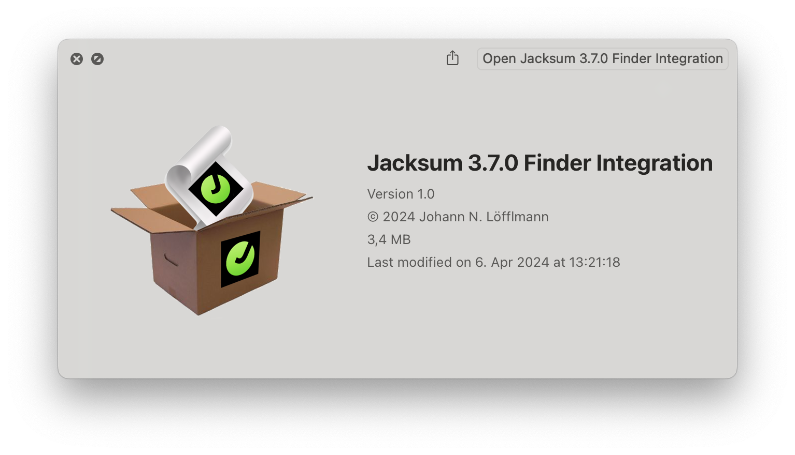
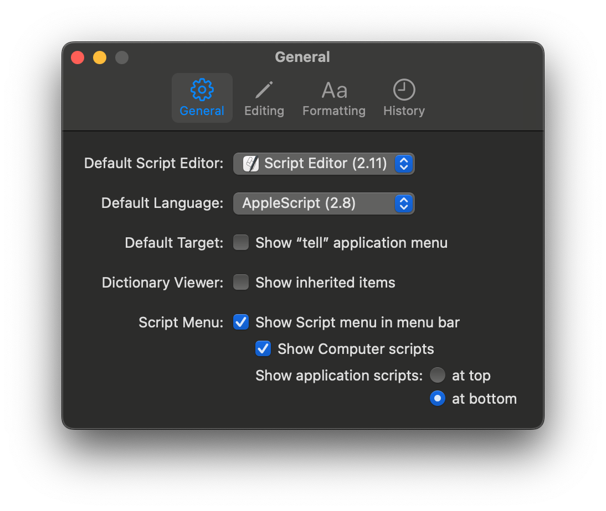

# Jacksum File Browser Integration on macOS



## Abstract

Allows macOS users to calculate hash values of their files and folders in Finder just by selecting a menu item from the script menu.

The Finder integration is powered by both
**[Jacksum](https://github.com/jonelo/jacksum)** (the engine) and
**[HashGarten](https://github.com/jonelo/HashGarten)** (the GUI).

See also [https://jacksum.net](https://jacksum.net).

## System Requirements

- OS X 10.8 (Mountain Lion) or later, tested up to macOS 14.4.1 (Sonoma)
- Finder
- JDK 11 or later, see also [https://adoptium.net](https://adoptium.net)
- 2 MiB disk space for Jacksum and HashGarten

## Quick Start

### How to install it

#### 1. Download and install a Java Runtime Environment

Go to [https://adoptium.net](https://adoptium.net) and download and install Temurin which is the OpenJDK-distribution from Adoptium. A Java Runtime Environment (JRE) is enough, but you can also install a full Java Development Kit (JDK).

#### 2. Activate the Apple Script Menu

See also [https://support.apple.com/en-us/guide/script-editor/scpedt27975/mac](https://support.apple.com/en-us/guide/script-editor/scpedt27975/mac)



#### 3. Download and open the .dmg

Download and open the [.dmg](https://github.com/jonelo/jacksum-fbi-macos/releases/latest).

#### 4. Open on the .app


### How to use it

#### Using Finder and the script menu

Go to Finder, select files and folders and choose an action from the script folder called "Jacksum 3.7.0".


From here [HashGarten](https://github.com/jonelo/HashGarten) takes over, and you can calculate checksums, CRCs and hash values of the selected files.

#### Using the command line interface (CLI)

Open a Terminal, and you have full access to the CLI. Now you can use all features that Jacksum provides.

```
$ /Applications/Jacksum/jacksum
```

For more information see also [Jacksum](https://github.com/jonelo/jacksum)

### How to configure it

Open Finder, hit ⇧⌘G, enter the path to the Finder scripts folder `~/Library/Scripts/Applications/Finder`, and click on the Go button.
Click on `Jacksum 3.7.0`, and remove any .scpt file that you do not want to see.

### How to recreate all items again

Just run the .app again.

### How to uninstall it

Open a terminal and type
```
rm -Rf ~/Library/Scripts/Applications/Finder/Jacksum*
rm -Rf /Applications/Jacksum
```


## For Developers

### How to create the .app and .dmg

#### 1. Download and install the Platypus command line tool

The .app will be created by the Platypus command line tool. Platypus is a great tool create Mac apps from command line scripts.
Go to https://sveinbjorn.org/platypus, download and open Platypus, select "Settings..." from the Platypus menu and install the command line tool.

#### 2. Clone the sources

Clone or download the sources from the GitHub project:
```
git clone https://github.com/jonelo/jacksum-fbi-macos.git
cd jacksum-fbi-macos/
```

Note: if you haven't installed git yet, Apple's Install Command Line Developer Tools will install it for you.

#### 3. Build both the .app and the .dmg

Open a terminal and run
```
./bin/make_all.sh
```
That will build the .app and wrap it in a .dmg. You find both the .app and the .dmg in the folder called ./output/.

#### 4. Open the .dmg and test the .app

```
open ./output/*.dmg
```

### How does that all work?

The core of the .app is bash script that installs calls to HashGarten and Jacksum to macOS Finder's Script Menu by creating applescript scripts and compiling those on the system during the installation.
